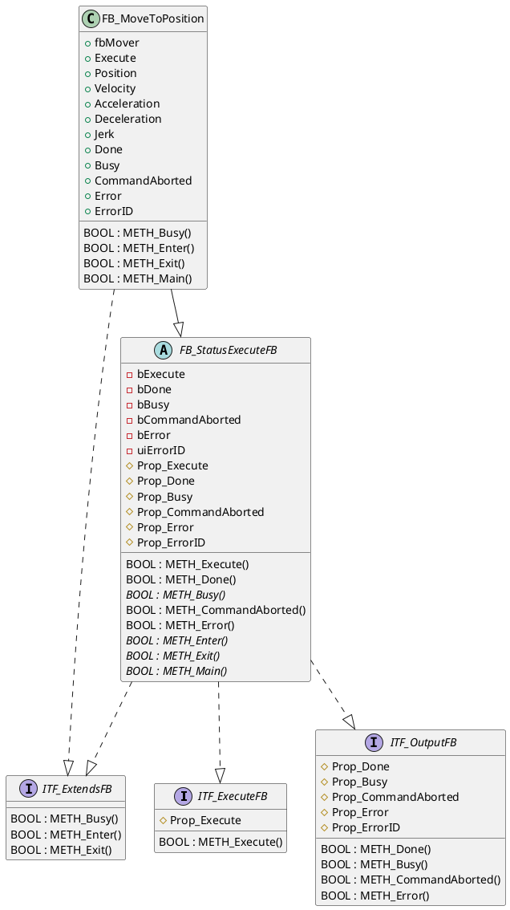

# FB_Moveo

```plantuml
@startuml
    interface ITF_ExecuteFB{
        # Prop_Execute
        BOOL : METH_Execute()
    }

    interface ITF_OutputFB{
        # Prop_Done
        # Prop_Busy
        # Prop_CommandAborted
        # Prop_Error
        # Prop_ErrorID
        BOOL : METH_Done()
        BOOL : METH_Busy()
        BOOL : METH_CommandAborted()
        BOOL : METH_Error()
    }

    interface ITF_ExtendsFB{
        BOOL : METH_Busy()
        BOOL : METH_Enter()
        BOOL : METH_Exit()
    }

    abstract FB_StatusExecuteFB{
        - bExecute
        - bDone
        - bBusy
        - bCommandAborted
        - bError
        - uiErrorID
        # Prop_Execute
        BOOL : METH_Execute()
        # Prop_Done
        # Prop_Busy
        # Prop_CommandAborted
        # Prop_Error
        # Prop_ErrorID
        BOOL : METH_Done()
        {Abstract} BOOL : METH_Busy()
        BOOL : METH_CommandAborted()
        BOOL : METH_Error()
        {Abstract} BOOL : METH_Enter()
        {Abstract} BOOL : METH_Exit()
        {Abstract} BOOL : METH_Main()
    }

    class FB_MoveToPosition{
        + fbMover
        + Execute
        + Position
        + Velocity
        + Acceleration
        + Deceleration
        + Jerk
        + Done
        + Busy
        + CommandAborted
        + Error
        + ErrorID
        BOOL : METH_Busy()
        BOOL : METH_Enter()
        BOOL : METH_Exit()
        BOOL : METH_Main()
    }

    FB_StatusExecuteFB ..|> ITF_OutputFB
    FB_StatusExecuteFB ..|> ITF_ExecuteFB
    FB_StatusExecuteFB ..|> ITF_ExtendsFB
    FB_MoveToPosition ..|> ITF_ExtendsFB
    FB_MoveToPosition --|> FB_StatusExecuteFB
@enduml
```
