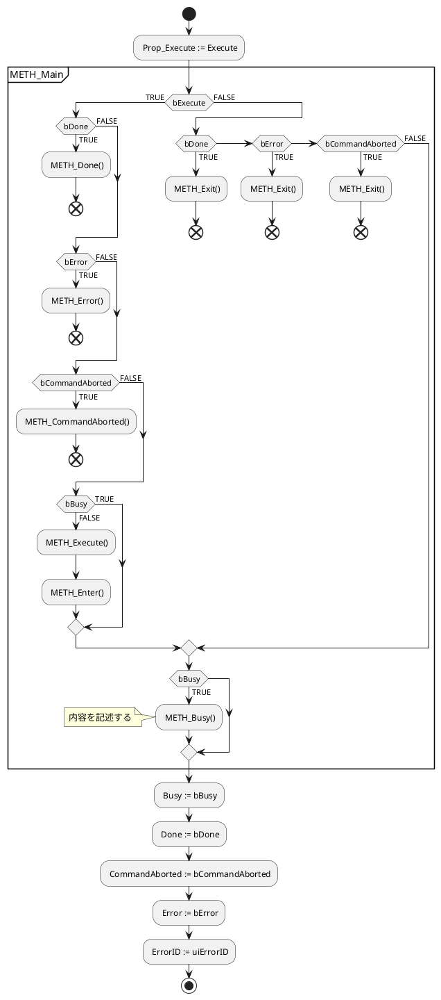

# FB_StatusExecuteFB系

```plantuml
@startuml
    start
    : Prop_Execute := Execute;

    partition METH_Main {
        if (bExecute) then (TRUE)
            if (bDone) then (TRUE)
                : METH_Done();
                end
            else (FALSE)
            endif
            if (bError) then (TRUE)
                : METH_Error();
                end
            else (FALSE)
            endif
            if (bCommandAborted) then (TRUE)
                : METH_CommandAborted();
                end
            else (FALSE)
            endif
            if (bBusy) then (TRUE)
            else (FALSE)
                : METH_Execute();
                : METH_Enter();
            endif
        else (FALSE)
            if (bDone) then (TRUE)
                : METH_Exit();
                end
            else if (bError) then (TRUE)
                : METH_Exit();
                end
            else if (bCommandAborted) then (TRUE)
                : METH_Exit();
                end
            else (FALSE)
            endif
        endif

        if (bBusy) then (TRUE)
            : METH_Busy();
            note left
                内容を記述する
            endnote
        endif
    }
    : Busy := bBusy;
    : Done := bDone;
    : CommandAborted := bCommandAborted;
    : Error := bError;
    : ErrorID := uiErrorID;
    stop
@enduml
```